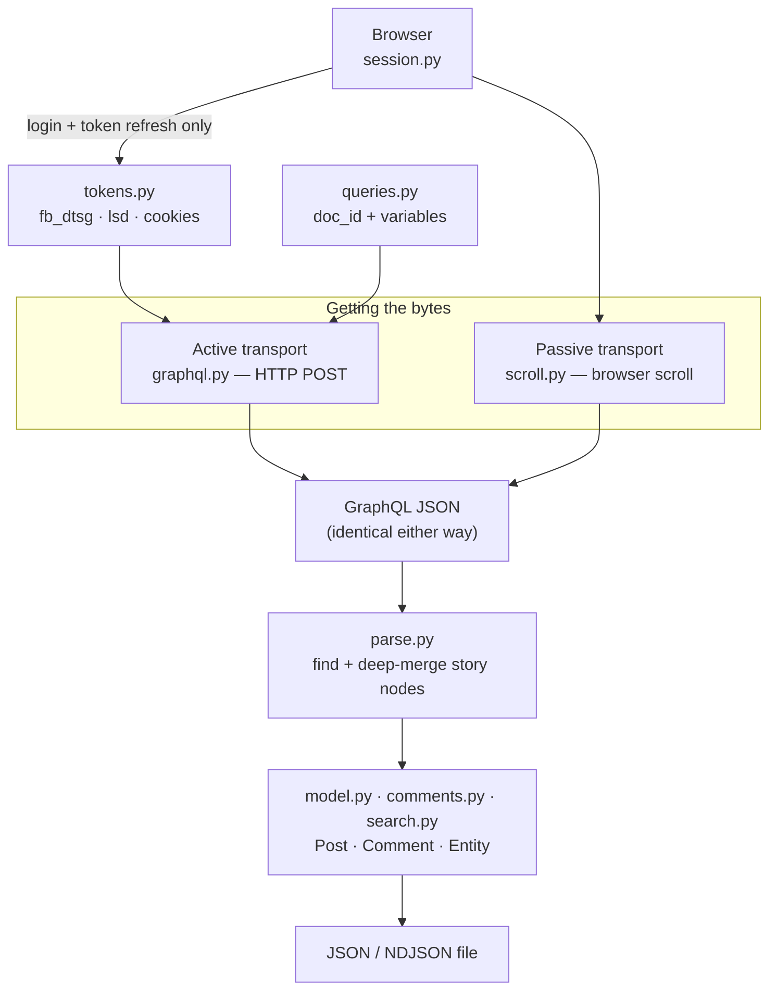

# Architecture

How `agentic-facebook` is built, and the vocabulary you need to reason about it. For anyone extending the project, debugging a failure, or deciding which transport to use.

## The one idea the whole design rests on

Facebook's web client does not render posts from HTML. It asks a single GraphQL endpoint — `POST https://www.facebook.com/api/graphql/` — and renders the JSON that comes back. **Everything this tool does is a way of getting that JSON.**

There are two ways to get it, and they produce *byte-identical* responses:

- **Passively**, by driving a real browser and reading the responses it was going to fetch anyway.
- **Actively**, by making the same HTTP request yourself, with the session tokens your browser already holds.

Because the bytes are the same, **one parser serves both.** That is not a convenience — it is the load-bearing invariant. It means a transport can be swapped, or fail over, without any risk of the two modes disagreeing about what a post is.

## Active vs passive

|  | **Active** (default) | **Passive** (fallback) |
|---|---|---|
| Mechanism | HTTP POST, paginated by cursor | Chromium scrolls; responses captured |
| Browser in the hot path | No — only to log in and refresh tokens | Yes, every fetch |
| Speed | Seconds | Tens of seconds |
| `--since` / `--until` | Precise — a server-side filter | Best-effort; may stop before reaching the date (exit 7) |
| Newest post on a timeline | Visible | **Invisible** — see below |
| Breaks when | Facebook rotates `doc_id`s | Facebook changes page structure |

Active mode is tried first and falls back automatically. `--mode active` or `--mode passive` forces one.

**Only `fetch` has a fallback.** `feed`, `comments`, `post`, `search`, and `group` are active-only — they were introduced after the browser path existed and never had a scroll implementation to fall back to. When a `doc_id` rotates, `fetch` slows down; the others simply fail until the package is updated.

**Passive cannot see a profile's newest post.** The first batch of a timeline is server-rendered into the initial HTML document rather than fetched as a GraphQL request, so a transport that only watches XHR traffic never observes it. This is structural, not a bug, and it is a concrete reason to prefer active mode.

## Vocabulary

Defined in dependency order — each builds on the one before.

**`doc_id`** — Facebook does not accept arbitrary GraphQL queries. Each query the client can make is pre-registered server-side and addressed by a numeric id. Active mode replays captured ids, which is why it is fast (no query text to send) and why it is fragile: ids change when Facebook ships a new client build.

**Relay provider flags** — each query also carries ~30 `__relay_internal__pv__*` booleans, feature toggles the client passes through. They are *not* optional: omitting them returns data along with `missing_required_variable_value` warnings. One shared set works for every query in the registry.

**Session tokens** — `fb_dtsg` (a CSRF token that rotates within a session), `lsd`, the acting user id, and the session cookies (`c_user`, `xs`, …). Active mode needs all of them. `jazoest` is *computed* from `fb_dtsg`, not scraped. These are extracted from a logged-in page and cached; refreshing them prefers a cheap HTTP re-read over relaunching a browser.

**Cursor** — feed connections paginate by opaque cursor. It arrives in one of two shapes: inline next to `edges`, or — more often, because feed connections are `@stream`ed — in a trailing deferred chunk whose `path` ends with the connection's name. A cursor lookup has to handle both, and must key on the *right* connection: a response carries unrelated nested connections (reactors, comment previews) whose cursors would paginate something else entirely.

**Feedback id** — every post has a `feedback` object whose id is the post's stable identity, and it is what `Post.id` reports. Comments are keyed to it. Note that comments are *also* feedback-shaped, which is why comment extraction cannot reuse the post walker.

**Story node** — the raw merged dict a post is parsed from. A single post can arrive split across several `@defer` chunks, so nodes are deep-merged by feedback id before anything reads a field off them.

## Module map

| Module | Responsibility |
|---|---|
| `cli.py` | Argument parsing and the exit-code contract; one handler per command |
| `catalog.py` | The CLI describing itself, derived from the live parser |
| `exits.py` | The exit-code contract, single-sourced |
| `retrieve.py` | Orchestration: pick a transport, paginate, window, sort |
| `graphql.py` | Active transport — request building, the cursor loop, the rate floor |
| `queries.py` | Registry of `doc_id`s, default variables, and the shared relay flags |
| `tokens.py` | Extract, cache (0600), and refresh session tokens |
| `session.py` | Browser lifecycle: login, status, setup, doctor |
| `scroll.py` | Passive transport — the scroll loop and its stop conditions |
| `parse.py` | Bytes → JSON → story nodes, deep-merged by feedback id |
| `model.py` | The `Post` schema and its field descriptions |
| `comments.py` | The `Comment` schema and comment extraction |
| `search.py` | The `Entity` schema and result-type shaping |
| `chrome.py` | Opt-in: decrypt cookies from a local Chrome profile |
| `redact.py` | Scrubbing for diagnostics (never for output files) |

## Design decisions worth knowing

**No `crawl` command, deliberately.** The CLI stays a set of single-purpose primitives; deciding which handle to follow next is the caller's job. A built-in crawler would bury the judgment that actually matters — how deep to go, what to sample — inside a flag.

**Guardrails live in code, not in documentation.** Two rate floors are clamped where they cannot be argued with: ≥1.0s between active requests and ≥0.5s between scrolls. The active floor exists because active mode fires HTTP requests with no scrolling at all, so the scroll floor stops constraining anything the moment the fast transport is used — without it, "one hard limit that keeps this from being a mass-scraper" would quietly have become false.

**Every active call is treated as fallible.** A rotated `doc_id`, a transport hiccup, or a non-200 raises a recoverable error rather than crashing, because the browser path can often still read the same data a slower way.

**Descriptions are derived, not written.** `agentic-facebook catalog` and `agentic-facebook schema` are generated from the parser and from the dataclasses' own `to_dict()` output, so they cannot drift from the code the way a hand-maintained table does.

---

**Next:** [Chaining Recipes](Chaining-Recipes.md) to put the primitives together, or [CLI Reference](CLI-Reference.md) for the full flag surface. · [Back to the index](README.md)
