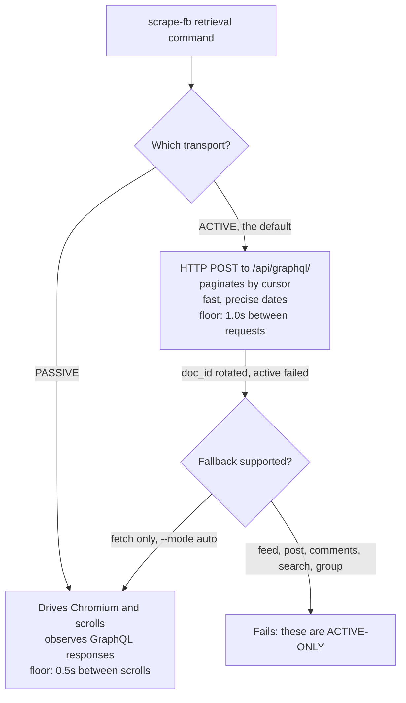

# CLI Reference

The authoritative flag-by-flag reference for every `scrape-fb` command — for anyone driving the tool from a shell, a script, or an agent.

## Read this first: `catalog` is the real authority

This page describes **v0.3.1**. The installed CLI can describe *itself*:

```bash
scrape-fb catalog          # human/agent-readable text
scrape-fb catalog --json   # the same content, machine-readable
```

`catalog` is **derived, never authored**: its command list and flag tables are introspected from the live `argparse` parser, its object schemas come from the same functions `scrape-fb schema` uses, and its exit codes come from `exits.DESCRIPTIONS`. It therefore cannot describe a command that doesn't exist or miss one that does.

**If this page and `scrape-fb catalog` ever disagree, `catalog` is right for the version you actually have installed.** Use this page for the prose, the examples, and the "why"; use `catalog` for ground truth.

## The output contract (the single most common mistake)

Every retrieval command (`fetch`, `feed`, `post`, `comments`, `search`, `group`) behaves the same way:

- **Results are written to a JSON file.** Only a one-line summary goes to **stderr**, and **nothing useful goes to stdout**. Run the command, then read the file.
- Without `--output`, the file lands under the platform data directory with a timestamped name — never the current directory, because captured posts contain third-party personal data.
- `--format json` writes one array; `--format ndjson` writes one object per line.
- `fetch`/`feed`/`post`/`search`/`group` emit `Post` objects; `comments` emits `Comment` objects; `search --type people|pages|groups` emits `Entity` objects instead of Posts.

Piping a retrieval command into `jq` gets you nothing. Read the path printed on stderr instead.

## The two transports



| Command | ACTIVE | PASSIVE | Fallback |
|---|---|---|---|
| `fetch` | yes | yes | active → passive, via `--mode auto` (the default) |
| `feed` | yes | no | none — active-only |
| `post` | yes | no | none — active-only |
| `comments` | yes | no | none — active-only |
| `search` | yes | no | none — active-only |
| `group` | yes | no | none — active-only |

Active mode replays Facebook query ids (`doc_id`) that rotate whenever Facebook ships a new client build. When that happens, `fetch` falls back to the browser automatically; the active-only commands simply fail until the package is updated.

## Global options

```bash
scrape-fb --version     # prints "scrape-fb 0.3.1" and exits 0
scrape-fb --help        # top-level usage
scrape-fb <cmd> --help  # per-command usage
```

`scrape-fb` with no subcommand is a usage error. **Usage errors exit 1, not argparse's default 2** — exit 2 already means "login required or session expired" in this CLI's contract, and a script reading exit codes must be able to tell a typo'd flag from an expired session.

Three flag groups recur across commands; they are documented once here and referenced below.

### Profile options (`login`, `status`, `doctor`, and every retrieval command)

| Flag | Default | Effect |
|---|---|---|
| `--profile NAME` | `default` | Which named login session to use. Each profile is an independent logged-in browser session. |
| `--profile-dir PATH` | unset | Override where this profile's browser data lives. Resolution order: this flag, then `$SFB_PROFILE_DIR`, then the platform data dir. See [Configuration](Configuration.md). |

### Output options (every retrieval command)

| Flag | Default | Effect |
|---|---|---|
| `--limit N` | unbounded | Stop after this many results. |
| `--format {json,ndjson}` | `json` | A single pretty-printed JSON array, or one NDJSON object per line. |
| `--output PATH` | timestamped file under the platform data dir | Where to write results. |
| `--raw` | off | Include the raw captured GraphQL node on each result (the `raw` field). |
| `--no-redact` | off | Disable PII scrubbing on `--raw` output. Prints an on-screen warning; the saved file will then contain unredacted third-party data. |
| `-v`, `--verbose` | off | Print the full (still redaction-scrubbed) error text instead of just the exception type name. |

### Active-transport options (every retrieval command)

| Flag | Default | Effect |
|---|---|---|
| `--request-interval MIN,MAX` | `1.0,2.0` | Jittered seconds between active-mode requests. **MIN is clamped to >= 1.0s in code and cannot be bypassed.** |
| `--max-pages N` | `20` | Active-mode pagination ceiling. |
| `--headed` | off (headless) | Show the browser window. Debugging only. |

---

# Session commands

## `login`

One-time interactive login. Opens a real, visible Chromium window so you can log in to Facebook by hand, including any 2FA challenge. **Login completion is detected automatically** — you do not need to press anything. The session (cookies plus local storage) is then persisted under the named profile.

You need this once per profile, and again whenever [`status`](#status) reports the session expired or was checkpointed.

| Flag | Default | Effect |
|---|---|---|
| `--profile NAME` | `default` | Name of the login profile to save. |
| `--profile-dir PATH` | unset | Override where this profile's browser data lives. |
| `--timeout-seconds N` | `300.0` | How long to wait for you to finish logging in before giving up. |
| `--from-chrome` | off | Import an existing Facebook session from your local Chrome instead of logging in. See the warning below. |
| `--chrome-profile NAME` | `Default` | Which Chrome profile to import from, when `--from-chrome` is used. |

**Example — normal login:**

```bash
scrape-fb login
# stderr: Logged in. Profile saved at /Users/you/Library/Application Support/scraper-for-facebook/profiles/default
```

**Example — a second, named profile with a longer window for slow 2FA:**

```bash
scrape-fb login --profile throwaway --timeout-seconds 600
```

**Example — import a session from Chrome:**

```bash
pip install 'scraper-for-facebook[chrome]'
scrape-fb login --from-chrome --chrome-profile "Profile 1"
# stderr: Imported a Facebook session from Chrome profile 'Profile 1' (user 100000000000000).
#         Active-mode commands will use it.
```

> **`--from-chrome` is an opt-in with real consequences.** It decrypts Chrome's cookies via your OS keychain (which may prompt), and it almost always means importing your **main** account — directly against this tool's throwaway-account guidance. It requires the `[chrome]` extra. A failed import exits 2. Read [../DISCLAIMER.md](../../DISCLAIMER.md) on ban risk first.

Exit codes: `0` on success; `2` if login could not be verified (still seeing a login wall) or a Chrome import failed; `1` on any other failure.

## `status`

Check whether a profile is logged in, without doing any scraping.

| Flag | Default | Effect |
|---|---|---|
| `--profile NAME` | `default` | Which login session to check. |
| `--profile-dir PATH` | unset | Override where this profile's browser data lives. |
| `--json` | off | Emit machine-readable JSON to **stdout** instead of a human summary to stderr. |

**Example:**

```bash
scrape-fb status
# stderr: status: logged_in (logged in 4213s ago)

scrape-fb status --json
# stdout: {"status": "logged_in", "session_age_seconds": 4213.0}
```

Exit codes track the session state: `0` logged in, `2` expired, `3` checkpointed, `1` if the check itself failed. That makes `status` the right thing to gate a script on:

```bash
scrape-fb status --profile throwaway || { echo "log in first"; exit 1; }
```

## `setup`

Provision the browser (Chromium via Playwright) into an isolated cache under the tool's own data directory, never shared with any other tool's browser install. Run this once after installing.

| Flag | Default | Effect |
|---|---|---|
| `--force` | off | Reinstall even if already provisioned. |

**Example:**

```bash
scrape-fb setup
# stderr: Browser provisioned.

scrape-fb setup --force   # after a corrupted or partial install
```

Exit codes: `0` on success, `1` on failure.

## `doctor`

Launch the browser against the saved profile and verify that a capture actually round-trips. Reach for this when a retrieval command returns exit 4 (zero results) and you need to tell "nothing there" from "something is broken".

| Flag | Default | Effect |
|---|---|---|
| `--profile NAME` | `default` | Which login session to test. |
| `--profile-dir PATH` | unset | Override where this profile's browser data lives. |

**Example:**

```bash
scrape-fb doctor
```

Exit codes: `0` if the round-trip succeeded, `1` if it did not. The diagnostic message goes to stderr, redaction-scrubbed.

---

# Introspection commands

Both are **offline** — no login, no network, no browser — and both write to **stdout**, so piping into `jq` works.

## `schema`

Print the output object schemas: `Post`, `Comment`, and `Entity`.

| Flag | Default | Effect |
|---|---|---|
| `--json` | off | Emit JSON Schema (draft 2020-12) instead of a plain annotated listing. |

**Example:**

```bash
scrape-fb schema
scrape-fb schema --json | jq '.Post.properties.reaction_count'
```

Field-by-field prose lives in [Output Schema](Output-Schema.md). Exit code: `0`.

## `catalog`

Describe the whole CLI to a caller: every command, its flags, the exit codes, the output contract, and the known limitations. Point an agent or a script at this instead of transcribing this page.

| Flag | Default | Effect |
|---|---|---|
| `--json` | off | Emit the catalog as JSON for programmatic use instead of a text listing. |

**Example:**

```bash
scrape-fb catalog
scrape-fb catalog --json | jq -r '.commands | keys[]'
scrape-fb catalog --json | jq -r '.exit_codes | to_entries[] | "\(.key): \(.value)"'
```

Exit code: `0`.

---

# Retrieval commands

All six share the profile, output, and active-transport option groups above. All six write results to a file and print only a summary to stderr.

## `fetch`

Fetch posts from a profile timeline. **The only command that supports both transports**, and the only one that can fall back from active to passive.

Positional: `identifier` — a profile URL, a bare vanity name, or a numeric id. Accepted forms: `zuck`, `4`, `profile.php?id=4`, or a full `https://` URL on `facebook.com` / `www.facebook.com` / `m.facebook.com`. Anything else is rejected before it ever reaches the browser (exit 1).

Flags beyond the shared groups:

| Flag | Default | Effect |
|---|---|---|
| `--since YYYY-MM-DD` | unset | Keep posts on/after this date. Precise in active mode (server-side filter); best-effort within `--max-scrolls` when passive — see exit 7. |
| `--until YYYY-MM-DD` | unset | Keep posts on/before this date. |
| `--mode {auto,active,passive}` | `auto` | Transport. `active` reads the GraphQL API over HTTP (fast, precise dates); `passive` scrolls a browser; `auto` tries active and falls back. |
| `--scroll-pause MIN,MAX` | `2.0,4.0` | **Passive only.** Jittered seconds between scrolls. MIN is clamped to >= 0.5s and cannot be bypassed. |
| `--max-scrolls N` | `40` | **Passive only.** Scroll-iteration ceiling. If the budget runs out before `--limit`/`--since` is met, the run stops with them unmet. |

**Example:**

```bash
scrape-fb fetch zuck --limit 25 --since 2026-01-01 --output ~/fb/zuck.json
# stderr: 25 posts, range 2026-01-04..2026-07-18, stop reason: limit_reached. Saved to /Users/you/fb/zuck.json
jq -r '.[0].text' ~/fb/zuck.json
```

**Example — force the browser transport** (e.g. active mode is broken by a `doc_id` rotation):

```bash
scrape-fb fetch zuck --mode passive --max-scrolls 60 --scroll-pause 3,6 --limit 50
```

> Passive mode **cannot see a profile's newest post** — the first timeline batch is server-rendered into the HTML and never fetched as a GraphQL request. Active mode can.

## `feed`

Fetch posts from **your own** home news feed. Takes no positional argument — the feed belongs to whoever the profile is logged in as. **Active-only.**

Flags: the shared profile, output, and active-transport groups only.

**Example:**

```bash
scrape-fb feed --limit 30 --format ndjson --output ~/fb/feed.ndjson
# stderr: 30 posts, range 2026-07-16..2026-07-20, stop reason: limit_reached. Saved to /Users/you/fb/feed.ndjson
```

`feed --limit 3` is also the recommended probe when another command returns exit 4 and you need to know whether your session itself is healthy.

## `post`

Fetch a single post by permalink URL. **Active-only.**

Positional: `url` — a real post permalink. Reel URLs are unsupported (a reel page embeds no story id).

Flags: the shared groups. `--limit` and `--max-pages` are accepted but carry little meaning for a single post; the result is still written as a one-element array (or a single NDJSON line).

**Example:**

```bash
scrape-fb post "https://www.facebook.com/zuck/posts/1234567890" --raw --output ~/fb/one.json
# stderr: 1 post by Mark Zuckerberg. Saved to /Users/you/fb/one.json
```

With `--raw` and without `--no-redact`, the raw node is scrubbed recursively — including the raw node of any nested shared/quoted post.

## `comments`

Fetch comments on a post. **Active-only.**

Positional: `url` — a post permalink (same restriction as `post`; no reels).

Flags beyond the shared groups:

| Flag | Default | Effect |
|---|---|---|
| `--sort {top,recent}` | `top` | Comment ordering. |
| `--replies` | off | Also fetch replies (depth >= 1). Costs one extra request per commented comment — replies are never returned inline. |

**Example:**

```bash
scrape-fb comments "https://www.facebook.com/zuck/posts/1234567890" \
  --sort recent --replies --limit 50 --output ~/fb/comments.json
# stderr: 50 comments (18 replies), stop reason: limit_reached. Saved to /Users/you/fb/comments.json
```

Two limits worth knowing:

- `--limit` counts **top-level comments only**, so one heavily-replied comment cannot consume the whole budget.
- `--replies` fetches **depth-1 replies only**. A comment's `reply_count` includes deeper nested replies that are not returned.

Output is `Comment` objects, not `Post` objects.

## `search`

Search Facebook. **Active-only.**

Positional: `query` — the search text.

Flags beyond the shared groups:

| Flag | Default | Effect |
|---|---|---|
| `--type {top,posts,people,pages,groups}` | `top` | Which vertical to search. `top`/`posts` return `Post` objects; `people`/`pages`/`groups` return `Entity` records. |

**Example — find groups, then read them:**

```bash
scrape-fb search "urban gardening" --type groups --limit 10 --output ~/fb/groups.json
# stderr: 0 posts, 10 entities, stop reason: limit_reached. Saved to /Users/you/fb/groups.json
jq -r '.[] | "\(.name)\t\(.url)"' ~/fb/groups.json
```

`--type top` can return a mix: Posts and Entities are concatenated into the same output file, distinguishable by their fields (an `Entity` has `kind`/`name`; a `Post` has `text`/`author_name`).

## `group`

Fetch posts from a group's feed. **Active-only.**

Positional: `identifier` — a group URL, vanity slug, or numeric id.

Flags: the shared profile, output, and active-transport groups only.

**Example:**

```bash
scrape-fb group 123456789012345 --limit 40 --request-interval 2,4 --output ~/fb/group.json
# stderr: 40 posts, range 2026-06-30..2026-07-20, stop reason: limit_reached. Saved to /Users/you/fb/group.json
```

The logged-in account must be able to see the group. A private group you are not a member of comes back as exit 5 (target unavailable) or exit 4 (zero results).

---

## Exit codes

The contract lives in `src/scraper_for_facebook/exits.py` and is a public API — these numbers do not change without breaking someone's script.

| Code | Name | Meaning |
|---|---|---|
| `0` | `OK` | Success — limit met, requested date window fully reached, or feed genuinely exhausted. |
| `1` | `ERROR` | Unexpected error. Re-run with `-v` for the (redaction-scrubbed) detail. Also used for usage errors: bad flags, missing arguments, an invalid identifier. |
| `2` | `LOGIN_REQUIRED` | Login required or session expired. Run `scrape-fb login` (opens a real browser; needs a human). |
| `3` | `CHECKPOINT` | Account checkpoint — Meta flagged the session. **Do NOT retry:** hammering a checkpointed account turns a temporary block into a permanent one. |
| `4` | `NO_RESULTS` | Zero results. Ambiguous by nature: either genuinely nothing there, or parser drift / `doc_id` rotation. Probe with a known-good command (e.g. `feed --limit 3`) to tell them apart. |
| `5` | `TARGET_UNAVAILABLE` | Target unavailable (memorialized, blocked, restricted, or nonexistent). A definite answer, not a transient failure — do not retry with variations. |
| `7` | `SINCE_UNCONFIRMED` | Partial: `--since` was requested but not confirmed reached within the run's budget. The posts returned are real but may not be all of them in that range. |

There is no code `6`.

**On exit 7 specifically:** hitting `--limit` is a full success (`0`) even if `--since` was never independently confirmed crossed. Code `7` is reserved for "we genuinely don't know whether we reached `--since`" — the run stopped on its scroll budget, its page budget, or a stalled feed. Raising `--max-pages` (active) or `--max-scrolls` (passive) and re-running is the fix.

**Scripting example:**

```bash
scrape-fb fetch zuck --since 2026-01-01 --output ~/fb/zuck.json
case $? in
  0) echo "complete" ;;
  7) echo "partial — raise --max-pages and re-run" ;;
  4) echo "nothing found — probe with: scrape-fb feed --limit 3" ;;
  3) echo "CHECKPOINT — stop, do not retry"; exit 1 ;;
  *) echo "failed"; exit 1 ;;
esac
```

## Known limitations

Straight from `catalog`, so they live in exactly one place:

- Active mode replays Facebook query ids (`doc_id`) that rotate when Facebook ships a client build. `fetch` falls back to the browser automatically; `feed`/`comments`/`post`/`search`/`group` are active-only and simply fail until the package is updated.
- Passive mode cannot see a profile's newest post — the first timeline batch is server-rendered into the HTML, never fetched as a GraphQL request. Active mode can.
- `post`/`comments` require a real post permalink. Reel URLs are unsupported.
- `comments --replies` fetches depth-1 replies only.
- `--limit` on `comments` counts top-level comments only.
- Requests are rate-floored in code and cannot be bypassed: >= 1.0s between active requests, >= 0.5s between scrolls.

---

**Next:** [Configuration](Configuration.md) for every knob and where data lives, [Output Schema](Output-Schema.md) for the fields inside the files these commands write, and [Chaining Recipes](Chaining-Recipes.md) for multi-command workflows. Back to the [wiki index](README.md).
