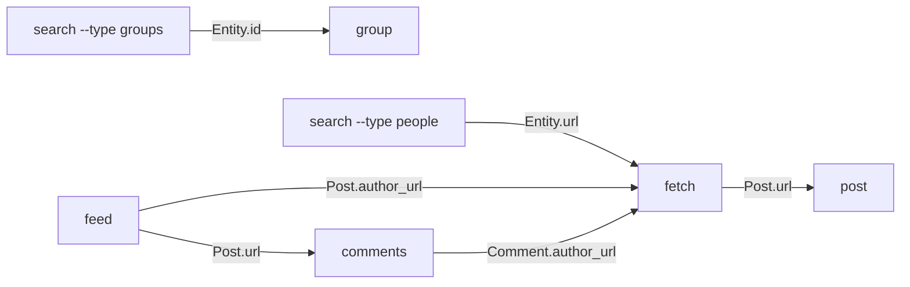

# Chaining Recipes

How to answer a question that no single command answers, by feeding one command's output into the next. For anyone using `agentic-facebook` beyond a one-shot fetch.

## Why there is no `crawl` command

Every retrieval command here does exactly one thing. That is a design decision, not a gap: the interesting part of "what is this person's circle arguing about?" is not the fetching, it is deciding *whose* timeline to open next and when to stop. Bury that in a `--depth` flag and you get a crawler that is confidently wrong about what you wanted.

So the tool does fast, structured retrieval, and **you supply the navigation.**

## The handles

Chaining works because every object carries the identifiers the next command takes.



| You have | You can run |
|---|---|
| a `Post.url` | `comments <url>` · `post <url>` |
| any `author_url` (post author or commenter) | `fetch <url>` |
| an `Entity.id` of a group | `group <id>` |
| an `Entity.url` of a person or page | `fetch <url>` |

Because retrieval writes JSON files rather than printing to stdout, each step is: run the command with `--output`, read the file, pull out the handles, run the next command.

## Recipe: what is one person's circle discussing?

```bash
agentic-facebook fetch someone.profile --limit 20 --output /tmp/them.json
# read /tmp/them.json → collect author_url from posts they shared,
#   i.e. shared_post.author_url where shared_post is not null
agentic-facebook fetch <each author_url> --limit 5 --output /tmp/circle_N.json
```

The people someone *reshares* are a better signal of their circle than the people they merely react to, and reshares are already in the payload — `shared_post` carries its own author, so the first fetch gives you the whole map without extra requests.

## Recipe: who engaged with this post, and what are they into?

```bash
agentic-facebook comments <post-url> --sort top --limit 20 --output /tmp/c.json
# read /tmp/c.json → collect distinct author_url (dedupe: one person often comments twice)
agentic-facebook fetch <each author_url> --limit 5 --output /tmp/person_N.json
```

Use `--sort top` when you want the voices the thread actually amplified, `--sort recent` when you want the current state of an argument. Add `--replies` only if the back-and-forth *is* the question — it costs one extra request per commented comment, so a busy post turns into a burst.

## Recipe: find the groups that are actually alive

```bash
agentic-facebook search "topic" --type groups --limit 25 --output /tmp/groups.json
# read /tmp/groups.json → these are Entity records (kind: "group"), not posts
agentic-facebook group <each id> --limit 10 --output /tmp/g_N.json
```

A search result tells you a group *exists*, never that anyone is talking in it. The second hop is what answers the question — and judge liveness by reaction and comment counts rather than posting frequency, because a group posting daily with zero engagement is an advertising board, not a community.

## Recipe: a topic across surfaces

```bash
agentic-facebook search "topic" --type posts --limit 20 --output /tmp/s.json
agentic-facebook feed --limit 30 --output /tmp/f.json
```

Merged results keep their provenance: every `Post` carries `source` (`timeline` · `newsfeed` · `group` · `search`), so you can pool them into one pile and still say where each came from. Dedupe on `id` — the same post genuinely can appear in both.

## Rules that keep a chain from becoming a crawl

**Bound the fan-out before you start it.** Decide the shape — "the most-engaged commenters", "the first ten groups" — before the first request, not after seeing how many there are. Every hop is a real request against a real account, and the rate floors (≥1.0s between active requests) mean a 60-way fan-out is minutes of sustained traffic against an account that can be checkpointed.

**Size every `--limit` from the question.** The numbers in these recipes are illustrative. "Is this group alive" needs a handful of posts; "what has she argued about this month" needs a date window and more. A limit copied from an example is a limit nobody chose.

**Report the shape of what you did.** Which hops you took, how many candidates you skipped, and why. A chain that sampled 5 of 60 commenters and presents itself as "what the commenters think" is a wrong answer wearing a confident summary — and the sampling is invisible in the output unless you say so.

**Stop on exit 3.** A checkpoint means the account was flagged. Continuing a chain through it is how a temporary block becomes a permanent ban.

**Delete intermediates.** The files written along the way are full of other people's names and words, and the middle steps of a chain rarely need keeping. See [Security and Privacy](Security-and-Privacy.md).

---

**Next:** [CLI Reference](CLI-Reference.md) for the full flag surface, or [Output Schema](Output-Schema.md) for the fields you will be reading. · [Back to the index](README.md)
