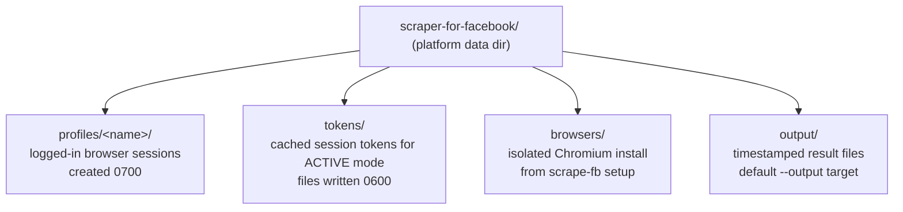

# Configuration

Every knob `scrape-fb` exposes — what it defaults to, what it actually changes, and which two limits you cannot turn off — for anyone tuning a run or wondering where their data went.

This page is about *why* the defaults are what they are. For the bare flag list per command, see [CLI Reference](CLI-Reference.md).

## Where everything lives

There is no config file. Settings are flags, plus one environment variable. State lives under a single platform data directory resolved by [platformdirs](https://pypi.org/project/platformdirs/):

| Platform | Data directory |
|---|---|
| macOS | `~/Library/Application Support/scraper-for-facebook/` |
| Linux | `~/.local/share/scraper-for-facebook/` |
| Windows | `%LOCALAPPDATA%\scraper-for-facebook\` |

Four subdirectories live under it:



- **`profiles/<name>/`** — one persisted, logged-in browser session per profile name (cookies plus local storage). Created at `0700`: that directory *is* an authenticated Facebook session with no password attached.
- **`tokens/`** — session tokens extracted for active mode, cached per login profile. Kept separate from the profile dir so a stale token cache can be cleared without destroying the expensive, 2FA-satisfied browser login it came from. Files are written `0600`.
- **`browsers/`** — the isolated Chromium install that `scrape-fb setup` provisions (roughly 300 MB). Deliberately never shared with any other Playwright-based tool's browser cache, so one tool's `install` can't silently break another's. Not user-configurable; delete it and re-run `scrape-fb setup`.
- **`output/`** — where results land when you don't pass `--output`.

## Login profiles: `--profile`, `--profile-dir`, `SFB_PROFILE_DIR`

A "profile" is a persisted, logged-in browser session — the same idea as a Chrome profile. Every command that touches the browser accepts `--profile`:

```bash
scrape-fb login  --profile work
scrape-fb status --profile work
scrape-fb feed   --profile work --limit 10
```

| Knob | Default | Effect |
|---|---|---|
| `--profile NAME` | `default` | Which named session to use. Sessions are fully independent — no shared state. |
| `--profile-dir PATH` | unset | Overrides the *root* directory profiles are stored under, for this invocation only. |
| `SFB_PROFILE_DIR` (env) | unset | Same override, for every invocation in the environment. |

Resolution order, exactly:

1. `--profile-dir PATH`, if given, always wins.
2. Otherwise `$SFB_PROFILE_DIR`, if set.
3. Otherwise `<platform data dir>/profiles/`.

Whichever root is in effect, the profile still lives at `<root>/<name>`, so the two compose:

```bash
export SFB_PROFILE_DIR=/Volumes/secure/fb-profiles
scrape-fb login --profile work
# -> session stored at /Volumes/secure/fb-profiles/work/
```

Both forms expand `~`. Note that `--profile-dir` and `SFB_PROFILE_DIR` move *profiles only* — `tokens/`, `browsers/`, and `output/` stay under the platform data dir.

You need more than one profile only if you log in to more than one Facebook account. Most people never do. See [Security and Privacy](Security-and-Privacy.md) before you back up, sync, or copy a profile directory anywhere.

## Pacing: the two floors you cannot remove

These are the two most consequential knobs, and the only two settings in the tool with a hard limit enforced in code.

| Knob | Default | Floor | Applies to |
|---|---|---|---|
| `--request-interval MIN,MAX` | `1.0,2.0` | MIN >= **1.0s** | ACTIVE transport (every retrieval command) |
| `--scroll-pause MIN,MAX` | `2.0,4.0` | MIN >= **0.5s** | PASSIVE transport (`fetch` only) |

Both take a jittered `MIN,MAX` pair; each wait is randomized inside that range so the traffic doesn't come out metronomic. Raising either value slows a run down and makes it look more human. Lowering either speeds it up and raises your account's checkpoint/ban risk.

### They are clamped in code, and they cannot be set to zero

`clamp_request_interval` and `clamp_scroll_pause` in `config.py` raise anything below the floor before it is ever used. Passing a lower value is not an error; it is silently raised, with a note on stderr telling you what was actually used:

```
scrape-fb: --scroll-pause 0,0.2 raised to 0.5,0.5 (minimum is 0.5s)
scrape-fb: --request-interval 0,0.1 raised to 1.0,1.0 (minimum is 1.0s)
```

If you pass a MAX below the clamped MIN, the MAX is raised to match. The clamp applies **regardless of how the value arrives** — CLI flag, environment, or a direct Python API call. There is no flag, environment variable, config file, or keyword argument that disables it.

**Why both floors exist, and why there are two:**

Zero-delay retrieval is simultaneously the most ban-inducing setting available and the thing that would turn this from a personal tool into a mass-scraping one. The scroll floor alone used to be the single hard limit — but active mode reaches the same data over plain HTTP POSTs with no scrolling at all, so a scroll-only floor would stop constraining volume the moment that transport was used. The request-interval floor is deliberately identical in shape and spirit, so that "just switch to active mode" is not a way around the guardrail.

The two floors together are what make the claim "this is a personal tool, not a crawler" actually true rather than merely stated. They also protect you directly: a browser session retrieving far faster or more persistently than a human is exactly the signal Meta's abuse detection is built to catch, and a checkpoint (exit 3) is the cheap outcome — a permanent ban is the expensive one.

**When to raise them:** whenever you are doing a deep pull and would rather it run slow. Raising is always safe.

**When to lower them:** essentially never. The defaults are already a deliberately cautious starting point. If a run feels too slow to watch, use `--headed` and watch it instead of speeding it up.

## Volume ceilings: `--max-pages` and `--max-scrolls`

| Knob | Default | Applies to | Effect |
|---|---|---|---|
| `--max-pages N` | `20` | ACTIVE (every retrieval command) | Ceiling on cursor pages a single pagination loop will walk. |
| `--max-scrolls N` | `40` | PASSIVE (`fetch` only) | Ceiling on scroll iterations in one run. |

Both are ordinary, fully overridable defaults — unlike the pacing floors, nothing clamps them. They exist because deep pagination means more requests and more ban risk, and an unbounded loop is precisely how a personal tool becomes a crawler.

If either budget runs out before `--limit` or `--since` is satisfied, the run stops with them unmet. When `--since` was requested and the stop reason was a budget or a stalled feed, the command exits **7** rather than 0 — "we genuinely don't know whether we reached that date". Raise the relevant ceiling and re-run:

```bash
scrape-fb fetch zuck --since 2025-01-01 --max-pages 60
```

Note that `--limit` composes with these: hitting `--limit` is a full success (exit 0) even if `--since` was never independently confirmed crossed.

## Output: `--output`, `--format`

| Knob | Default | Effect |
|---|---|---|
| `--output PATH` | `<data dir>/output/<identifier>-<timestamp>.<ext>` | Where results are written. Parent directories are created as needed. |
| `--format {json,ndjson}` | `json` | `json` writes one pretty-printed array; `ndjson` writes one object per line. Also picks the default filename's extension. |
| `--limit N` | unbounded | Stop after N results. |

Every retrieval command **writes to a file** and prints only a one-line summary to stderr — nothing useful reaches stdout. The default location is deliberate: captured posts contain other people's names, message text, and signed media URLs, and defaulting outside any git-tracked path makes it much harder to accidentally commit someone else's personal data. Never the current working directory, never a repo.

```bash
scrape-fb feed --limit 30 --format ndjson --output ~/fb/feed.ndjson
```

`--output` changes only where results go; it does not affect profiles, tokens, or the browser cache. Whatever path you choose, the file's contents are as sensitive as what they contain.

## Raw capture: `--raw` and `--no-redact`

| Knob | Default | Effect |
|---|---|---|
| `--raw` | off | Attach the raw captured GraphQL node to each result as a `raw` field. |
| `--no-redact` | off | Disable PII scrubbing on that raw output. |

Without `--raw`, results contain only the parsed, documented fields. With `--raw`, the underlying node is included too — useful for debugging a parse or recovering a field the parser doesn't expose yet.

By default, `--raw` output is **scrubbed** before it is written, recursively: the top-level post's raw node *and* the raw node of every nested shared/quoted post down the chain. `--no-redact` turns that scrubbing off and prints a warning:

```
WARNING: --no-redact leaves --raw output unscrubbed. The saved file will contain
unredacted third-party data. See DISCLAIMER.md.
```

Treat `--no-redact` as a debugging tool for data you are about to delete, not a normal setting. Scraping other people's posts can make *you* a data controller over their personal data — see [Security and Privacy](Security-and-Privacy.md) and [../DISCLAIMER.md](../../DISCLAIMER.md).

## Transport: `--mode`

| Knob | Default | Effect |
|---|---|---|
| `--mode {auto,active,passive}` | `auto` | `fetch` only. `active` reads the GraphQL API over HTTP; `passive` drives a browser and scrolls; `auto` tries active and falls back to passive. |

`fetch` is the only command that supports both transports. `feed`, `post`, `comments`, `search`, and `group` are **active-only** and have no `--mode` flag at all — when active mode breaks (Facebook rotates the `doc_id` query ids on a client build), they fail until the package is updated, while `fetch` keeps working via fallback.

Pick `--mode active` when you want speed and server-side-precise `--since` filtering. Pick `--mode passive` when active mode is broken or you specifically want the browser path. Leave it on `auto` otherwise.

## Browser visibility: headless vs `--headed`

| Knob | Default | Effect |
|---|---|---|
| `--headed` | off — the browser runs **headless** | Show the browser window during the run. |

Retrieval commands run headless by default. `--headed` is a debugging aid: it lets you watch what the session actually sees, which is the fastest way to spot a login wall, a checkpoint interstitial, or a page that simply isn't loading. It does not change pacing, results, or the output contract.

`scrape-fb login` is the exception — it always opens a real, visible window, because a human has to type into it.

## Diagnostics: `-v` / `--verbose`

| Knob | Default | Effect |
|---|---|---|
| `-v`, `--verbose` | off | Print the full error text instead of just the exception type name. |

Errors are terse by default (`unexpected error: KeyError (rerun with -v for details)`) so a stack-shaped message never dumps captured content onto your terminal. The verbose text is still redaction-scrubbed.

---

**Next:** [CLI Reference](CLI-Reference.md) for the per-command flag tables, [Security and Privacy](Security-and-Privacy.md) for what these paths and defaults are protecting, and [FAQ and Troubleshooting](FAQ-and-Troubleshooting.md) when a run stops early. Back to the [wiki index](README.md).
