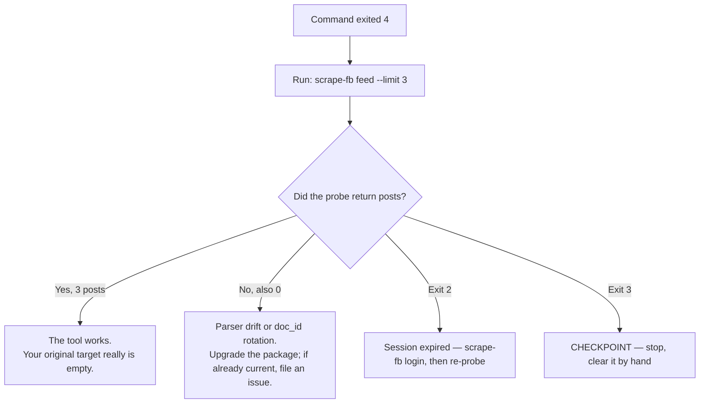

# FAQ and Troubleshooting

The failures people actually hit with `scrape-fb`, what each one means, and what to do about it.

This page describes **v0.3.1**. When it disagrees with `scrape-fb catalog` on flags or exit codes, `catalog` is right — it is derived from the installed code, this page is prose.

## Start here: the exit code told you more than the message did

Every `scrape-fb` run ends with an exit code that is part of the CLI's public contract. Scripts depend on these numbers, so they do not change casually. Reading the code first will save you most of the debugging on this page.

| Code | Meaning | What to DO |
|---|---|---|
| `0` | Success — limit met, `--since` window fully reached, or the feed genuinely ran out. | Read the output file whose path was printed on stderr. |
| `1` | Unexpected error. | Re-run with `-v` for the full (redaction-scrubbed) detail. If it reproduces, file an issue with that output. |
| `2` | Login required, or the session expired. | Run `scrape-fb login`. It opens a real browser and needs a human — you cannot script past this. |
| `3` | **CHECKPOINT** — Meta flagged the session. | **Stop. Do not retry.** Open facebook.com in a normal browser as that account and clear the challenge by hand. |
| `4` | Zero results. | Ambiguous — see [I got 0 posts](#i-got-0-posts-and-exit-code-4) below. Do not assume the target is empty. |
| `5` | Target unavailable — memorialized, blocked, restricted, or nonexistent. | Nothing to fix. This is a definite answer, not a transient failure; retrying with variations will not help. |
| `7` | `--since` was requested but not confirmed reached within the run's budget. | The posts you got are real, but may not be all of them in that range. Raise `--max-pages`, or accept a partial result. |

Two of these deserve emphasis.

**Exit 3 is the one code you must never retry.** A checkpoint is Meta saying "we think this session is automated." A temporary block that you leave alone usually clears; a temporary block that you hammer with retries becomes a permanent one. No `--limit`, no backoff, no different command — stop the automation entirely and go clear the challenge interactively.

**Exit 5 is a definite answer.** Trying `--mode passive`, a different URL form, or the same target an hour later is wasted requests against an account whose request budget is the scarce resource. Believe it the first time.

A script that handles these correctly looks like:

```bash
scrape-fb fetch some.person --limit 50 --output ./out.json
case $? in
  0) : ;;                                            # good
  7) echo "partial: --since not confirmed reached" ;; # data is usable
  4) echo "empty — probe with: scrape-fb feed --limit 3" ;;
  2) echo "run: scrape-fb login"; exit 1 ;;
  3) echo "CHECKPOINT — stop, do not retry"; exit 1 ;;
  5) echo "target unavailable — do not retry"; exit 1 ;;
  *) echo "unexpected; re-run with -v"; exit 1 ;;
esac
```

## I got 0 posts (and exit code 4)

Exit 4 is **ambiguous by design**, and the tool cannot resolve the ambiguity for you. Zero results means one of two very different things:

1. There is genuinely nothing there — an empty timeline, a search with no matches, a post with no comments, a `--since` window containing no activity.
2. The tool is broken for this surface — Facebook rotated a `doc_id` or changed a response shape, and the parser is now walking a structure that no longer exists. It finds nothing, so it reports nothing.

These look identical from the outside. To tell them apart, run a command you know should return data:

```bash
scrape-fb feed --limit 3
```



If the probe returns posts, the machinery is fine and your original query is genuinely empty. If the probe *also* returns zero, the problem is the package, not the target — upgrade first (see [upgrade didn't take effect](#i-upgraded-but-the-old-version-is-still-running)), and file an issue if you are already on the latest release.

Pick a probe you have reason to trust. `feed --limit 3` is a good default because your own home feed is almost never empty and the limit keeps it cheap.

## "active mode failed, falling back to browser"

You will see this on stderr:

```
scrape-fb: active mode failed (...); falling back to browser
```

That message is informational, not an error — the run continued. But it tells you something worth understanding.

**What active mode is.** By default `scrape-fb` talks to Facebook's GraphQL endpoint over plain HTTP, replaying the same query ids (`doc_id`) that Facebook's own web client uses, with the session tokens your logged-in browser already holds. It is much faster than driving a browser and gives server-side-precise date filtering.

**What doc_id rotation is.** Those query ids are not a stable API. They are build artifacts of Facebook's web client, and when Facebook ships a new build, the ids change. A replayed id that no longer exists gets rejected, and active mode fails.

**Why only `fetch` survives it.** `fetch` (a profile's timeline) is the one surface with a passive implementation — a real Chromium browser that scrolls the page and observes the GraphQL responses that the client itself makes, so it never needs to know a `doc_id`. Under the default `--mode auto`, `fetch` tries active, catches the failure, and falls back to that browser path.

`feed`, `post`, `comments`, `search`, and `group` have no passive implementation to fall back to. They are **active-only**, and they do not have a `--mode` flag at all. When the ids rotate, those commands simply fail until the package ships updated ids.

| Command | Active | Passive | Behavior after rotation |
|---|---|---|---|
| `fetch` | yes | yes | Falls back to the browser automatically |
| `feed` | yes | no | Fails until updated |
| `post` | yes | no | Fails until updated |
| `comments` | yes | no | Fails until updated |
| `search` | yes | no | Fails until updated |
| `group` | yes | no | Fails until updated |

So: if you see the fallback message occasionally, ignore it. If active-only commands start failing or returning zero across the board, that is the signal to upgrade the package.

The fallback is also slower, and pays the passive limitation described next.

## The newest post is missing

This is a real, structural limitation of passive mode, not a bug you can configure around.

Passive mode works by watching the GraphQL responses a scrolling browser makes. But **the first batch of a profile's timeline is server-rendered directly into the page HTML** — Facebook does not fetch it as a GraphQL request, because it already has it. There is no response to observe, so the passive parser never sees those posts, including the most recent one.

Active mode does not have this problem: it asks for the timeline explicitly and gets everything including the newest post.

Practically:

- If you need the newest post, use active mode (`--mode active`, or the `auto` default when active mode is healthy).
- If you are on `--mode passive` — by choice or because active mode fell back — expect a hole at the top of the timeline.
- If you ran `fetch` and the newest post is missing *and* you saw the fallback message on stderr, those two facts are the same fact.

## Reel URLs don't work with `post` or `comments`

They are unsupported, and this will not be fixed by retrying with a different URL shape.

`post` and `comments` need a real post permalink because they operate on a **story id**. A reel page does not embed one — there is nothing on that page for the tool to key on. This is a property of what Facebook serves, not a parsing gap.

Use a normal post permalink (the URL you get from a post's timestamp or its "Copy link" menu item). If the content only exists as a reel, these two commands cannot reach it.

## `--replies` returned fewer replies than `reply_count` says

Both numbers are correct; they count different things.

`comments --replies` fetches **depth-1 replies only** — the direct replies to a top-level comment. A comment's `reply_count` field is Facebook's own number, and it includes deeper nested replies (replies to replies, and so on) that the tool does not return. A thread with 3 direct replies that each got 4 responses will report a `reply_count` around 15 while `--replies` hands you 3.

Related, and a separate common surprise: **`--limit` on `comments` counts top-level comments only**. That is deliberate — otherwise a single comment with 200 replies would consume your entire budget and you would get one thread instead of a cross-section of the conversation.

## `status` says expired, but my browser is logged in

Trust `status`.

Facebook does not redirect an expired session to a login page. It serves the **login form in place, at the same URL, with HTTP 200 and no redirect**. Any check based on the response's URL or status code therefore sees a perfectly healthy page and reports a dead session as live. This was a real false positive in this tool: a 15-day-old dead session was rendering the login form while `status` cheerfully reported `logged_in`.

`status` now inspects the **response body** instead. It looks for login-form markers, and — more importantly — for the *absence* of `"DTSGInitialData"`, the token every genuinely logged-in Facebook page carries. Checking for the absence of what a good page always has catches logged-out shapes that no marker list anticipated.

The two states are also easy to confuse for a different reason: your everyday Chrome being logged in says nothing about the profile `scrape-fb` uses. They are separate sessions with separate cookies. Unless you used `--from-chrome`, your browser's login and this tool's login are unrelated — one can expire while the other stays healthy.

`status` exits `0` when logged in, `2` when expired, `3` on a checkpoint. If it says expired, run `scrape-fb login`.

## It's slow. Can I speed it up?

Partly, and only up to a floor that is enforced in code.

Two minimums cannot be set to zero, cannot be overridden by a flag, and cannot be bypassed by calling the Python API directly:

- **≥ 1.0s between active (HTTP GraphQL) requests**
- **≥ 0.5s between scrolls**

If you pass `--request-interval` or `--scroll-pause` below the floor, the value is silently raised and a note is printed to stderr. This is not conservatism for its own sake. Speed *is* the ban risk: a burst of API requests is far more conspicuous than a person scrolling, and unmetered pagination is exactly what separates a personal tool from a mass-scraper. The floors are the one hard limit in this project, so they apply to every transport equally — otherwise "switch to active mode" would be a way around them.

What you *can* do to make a run finish sooner:

- Use `--limit`. Most of the time you want a sample, not an archive, and a limit is the cheapest way to say so.
- Prefer active mode over passive when it is healthy — it is genuinely faster per post, within the same floor.
- Avoid deep `--max-pages` and `comments --replies` unless you need them. Both multiply request counts.
- Narrow `--since` rather than fetching everything and filtering afterward.

## Where did my output file go?

Not to your current directory — never to your current directory.

Every retrieval command writes results to a **JSON file** and prints only a one-line summary to stderr. Nothing useful goes to stdout, so piping `scrape-fb fetch ... | jq` gets you nothing. Run the command, read the path it printed, then open that file.

Without `--output`, results land under the platform data directory with a timestamped name. This is deliberate: captured posts contain third-party personal data, and defaulting to `.` would eventually drop that data into someone's git repository. Pass `--output PATH` when you want to choose the location — and see [Security and Privacy](Security-and-Privacy.md) for what you are taking responsibility for when you do.

Exact paths are in [Configuration](Configuration.md).

## I upgraded, but the old version is still running

Check what you actually have:

```bash
scrape-fb --version
```

If that prints the old number after an upgrade, the usual cause is `uv`'s index cache serving a stale package list — it does not know a new release exists, so it "upgrades" you to the version you already have. Force it to look again:

```bash
uv tool upgrade --no-cache scraper-for-facebook
```

Or reinstall from scratch with the same flag:

```bash
uv tool install --no-cache --force scraper-for-facebook
```

This matters more than a normal version bump, because `doc_id` rotation fixes ship as releases. If active-only commands are failing and you "already upgraded," verify with `--version` before concluding the fix does not work.

## Filing a bug report

Open an issue at <https://github.com/tjdwls101010/Scraper-for-Facebook/issues>. Include:

- Your OS and Python version, and the `scrape-fb --version` output.
- The exact command you ran and the exit code it returned.
- The `-v`/`--verbose` stderr output. This is safe to paste — it is routed through the redaction path, which strips signed media URLs and token-shaped fields and truncates message text.
- For a suspected parser problem: whether `scrape-fb feed --limit 3` also returns zero.

**Never paste raw captured post bodies, and never generate a bug report with `--raw --no-redact`.** `--raw` alone still scrubs the captured node; `--no-redact` turns that off entirely and prints an on-screen warning for a reason. The result is other people's names, message text, and signed media URLs in the clear, in a public issue tracker. See [DISCLAIMER.md](../../DISCLAIMER.md) for what redaction does and does not guarantee.

If you think you have found a **security** issue rather than a bug, do not open a public issue — see [Security and Privacy](Security-and-Privacy.md#reporting-a-vulnerability).

---

**Next:** [Security and Privacy](Security-and-Privacy.md) for what the login profile and output files actually are, [CLI Reference](CLI-Reference.md) for the per-command flags, and [Configuration](Configuration.md) for paths and pacing knobs. Back to the [wiki index](README.md).
