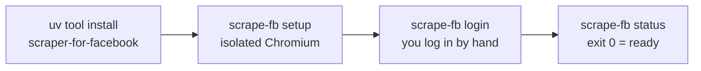

# Installation

How to get `scrape-fb` v0.3.1 onto your machine, keep it updated, and remove it cleanly — for anyone installing this tool for the first time.

## Before you start

| Requirement | Detail |
|---|---|
| Python | **3.11 or newer** (3.11, 3.12, 3.13 are tested) |
| Installer | [`uv`](https://docs.astral.sh/uv/) or [`pipx`](https://pipx.pypa.io/) — see the isolation warning below |
| Disk | a few hundred MB for the isolated Chromium that `scrape-fb setup` downloads |
| Account | a **throwaway Facebook account** you are willing to lose |

> **Use a throwaway account, never your primary one.** Automating a Meta account violates Facebook's Terms of Service and can get the account permanently banned. Read [../../DISCLAIMER.md](../../DISCLAIMER.md) before installing anything.

## Install it isolated — this is not optional

This package depends on `scrapling[fetchers]`, which **pins exact Playwright and patchright versions**. Dropping it into a virtualenv you share with anything else has two failure modes, and you will hit one of them:

- **Resolution fails outright** — something else in that environment wants a different Playwright, and the resolver cannot satisfy both.
- **Worse: it resolves, and quietly breaks the other tool.** Playwright's Python package and its browser binaries are version-matched. Installing this package can move the pin under another Playwright-based tool sharing the environment, which then fails at browser launch with an error pointing nowhere near this package.

So: **never `pip install scraper-for-facebook` into a shared virtualenv.** Use a tool installer, which gives the package its own environment and puts only the `scrape-fb` executable on your `PATH`.

```bash
uv tool install scraper-for-facebook
```

or

```bash
pipx install scraper-for-facebook
```

Both give you the same thing: the `scrape-fb` command, backed by a private environment nothing else shares.

## The `[chrome]` extra — only if you want `--from-chrome`

The base install is deliberately dependency-light. One optional path needs more:

```bash
uv tool install "scraper-for-facebook[chrome]"
# or
pipx install "scraper-for-facebook[chrome]"
```

The extra adds `cryptography`, used for exactly one thing: `scrape-fb login --from-chrome`, which decrypts your local Chrome cookie database to import an existing Facebook session instead of logging in by hand. Without the extra installed, that flag tells you so and stops.

**You probably do not want this.** Importing from Chrome usually means importing your *main* Facebook account — the exact thing the throwaway-account guidance exists to prevent. It also prompts for Keychain access to get the decryption key. Skip the extra unless you have a specific reason, and use the ordinary `scrape-fb login` flow.

## From source (contributors only)

If you are changing the code rather than using the tool:

```bash
git clone https://github.com/tjdwls101010/Scraper-for-Facebook.git
cd Scraper-for-Facebook
uv venv && source .venv/bin/activate
uv pip install -e ".[dev]"
pre-commit install
pytest
```

This is a dedicated project virtualenv, so the isolation rule above still holds — just don't reuse that venv for other Playwright work. See [Contributing](Contributing.md).

## Provision the browser: `scrape-fb setup`

Installing the package does not install a browser. Run this once:

```bash
scrape-fb setup
# Browser provisioned.
```

It downloads Chromium into **this tool's own cache**, under the platform data directory. `scrape-fb` sets `PLAYWRIGHT_BROWSERS_PATH` to that private path before any browser is provisioned or launched, so it never touches, upgrades, or corrupts a Playwright browser install that some other tool on your machine manages. That isolation is the entire reason this is a separate step instead of something the install does implicitly.

`scrape-fb setup --force` reinstalls even when a browser is already there — useful after an upgrade that moved the Playwright pin.



## Platform support

| Platform | Status |
|---|---|
| **macOS** | Tested, first-class. Everything documented here is verified against a live session on macOS. |
| **Linux** | Likely works for the fetch/parse/CLI layer — CI runs the full test suite on Ubuntu — but **untested against a live Facebook session**. Treat as best-effort. |
| **Windows** | **Unsupported.** Not tested, not in CI, and the release smoke tests assume a POSIX virtualenv layout. |

## Verify the install

Three checks, in increasing strength. The first two are offline and need no login:

```bash
scrape-fb --version     # -> scrape-fb 0.3.1
scrape-fb catalog       # every command, flag, and exit code, generated from the CLI itself
```

The third actually launches the provisioned browser, navigates to Facebook, and confirms a GraphQL response round-trips:

```bash
scrape-fb doctor
# OK - captured 4 graphql response(s)
```

`doctor` is a real functional check, not a `--version`-shaped stand-in: if it passes, the browser launches, navigates, and the capture pipeline works. If it reports that the browser launched but captured nothing, re-run `scrape-fb setup --force`.

Once you are here, go to [Quick Start](Quick-Start.md) to log in and get a first result.

## Upgrading

```bash
uv tool install --upgrade --no-cache scraper-for-facebook
```

**Do not drop `--no-cache`.** uv caches the package index, so shortly after a new release is published a plain `uv tool install --upgrade` can report that you are already on the latest version while a newer one exists on PyPI. The flag forces uv to re-read the index. If an upgrade appears to do nothing, this is almost always why — check `scrape-fb --version` afterwards to be sure.

With pipx:

```bash
pipx upgrade scraper-for-facebook
```

**After any upgrade, re-run `scrape-fb setup`.** If the new release moved the pinned Playwright/patchright version, the Chromium already in your isolated cache no longer matches the library and launches will fail. `setup` is cheap and does nothing when nothing changed.

Upgrading does **not** invalidate your login — the browser profile lives in the data directory, outside the package environment, and survives. Confirm with `scrape-fb status`.

Upgrades matter more for this tool than for most: active mode replays Facebook query ids (`doc_id`) that rotate whenever Facebook ships a client build, and a new release is how refreshed ids reach you. If `feed`, `comments`, `post`, `search`, or `group` suddenly returns nothing (exit code 4), upgrading is the first thing to try.

## Uninstalling and removing stored data

Removing the tool leaves your data behind on purpose — an accidental `uninstall` should not destroy a login that cost you a 2FA round trip.

```bash
uv tool uninstall scraper-for-facebook
# or
pipx uninstall scraper-for-facebook
```

That removes the package and the `scrape-fb` command. It leaves the platform data directory, which holds four things: `profiles/` (your logged-in browser sessions), `tokens/` (cached session tokens), `browsers/` (the isolated Chromium), and `output/` (every result file you didn't redirect with `--output`).

To remove that as well:

```bash
# macOS
rm -rf ~/Library/Application\ Support/scraper-for-facebook/

# Linux
rm -rf ~/.local/share/scraper-for-facebook/
```

**Do this once you are done with the tool.** `profiles/` holds a live, logged-in Facebook session, and `output/` holds other people's personal data from every capture you ran. Deleting the directory logs the profile out and destroys the captures — there is no undo. See [Security and Privacy](Security-and-Privacy.md) for what is stored and why it is sensitive, and [Configuration](Configuration.md) for how to relocate these paths.

---

**Next:** [Quick Start](Quick-Start.md) to log in and run your first retrieval, then [Configuration](Configuration.md) for profiles, paths, and pacing. Back to the [wiki index](README.md).
