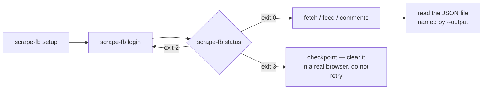

# Quick Start

Zero to a real result in five steps, with the one thing that trips up almost every first-time user stated up front — for anyone who has just installed `scrape-fb` and wants working output.

## Read this before anything else: results go to a file

**Every retrieval command (`fetch`, `feed`, `post`, `comments`, `search`, `group`) writes its results to a JSON file and prints only a one-line summary to stderr. Nothing useful goes to stdout.**

This is the single most common mistake. Piping a retrieval command into `jq`, `grep`, or `head` gets you nothing, because there is nothing on stdout to pipe. The data is in a file.

So the habit to build from your very first command is:

```bash
scrape-fb <command> ... --output ./result.json   # 1. run it, choose the path
cat ./result.json                                # 2. then open the file
```

Without `--output`, results still land in a file — a timestamped one under the platform data directory (`~/Library/Application Support/scraper-for-facebook/output/` on macOS), whose path is printed in the stderr summary. That default is deliberate: captured posts contain other people's personal data, so they never get written into your current directory or a git-tracked path by accident. But you will have a much better time if you name the path yourself.

## 1. Install and provision

```bash
uv tool install scraper-for-facebook   # or: pipx install scraper-for-facebook
scrape-fb setup
```

`setup` downloads Chromium into this tool's own isolated cache. Full detail, including why `pip install` into a shared virtualenv is a bad idea, is in [Installation](Installation.md).

> **Use a throwaway Facebook account.** Automating a Meta account violates its Terms of Service and risks a permanent ban. Never point this at an account you care about. See [../../DISCLAIMER.md](../../DISCLAIMER.md).

## 2. Log in, by hand, once

```bash
scrape-fb login
```

A real browser window opens. Log in to Facebook in it yourself — username, password, 2FA, whatever your account needs. There is no credential injection here: the tool never sees or stores your password, it just keeps the browser profile you produced.

Completion is **auto-detected**. Once the session is genuinely logged in, the command finishes on its own — you do not press a key or confirm anything. It waits up to 300 seconds by default; `--timeout-seconds` changes that.

```
A browser window is open. Log in to Facebook there — this will continue automatically once you are (waiting up to 300s).
Logged in. Profile saved at /Users/you/Library/Application Support/scraper-for-facebook/profiles/default
```

## 3. Verify the session

```bash
scrape-fb status
# status: logged_in (logged in 42s ago)
```

`status` is scriptable through its exit code, which is how you should check it in any automation:

| Exit | Meaning | What to do |
|---|---|---|
| **0** | Logged in and ready | Go fetch something |
| **2** | Login required or session expired | Run `scrape-fb login` again |
| **3** | Account checkpoint — Meta flagged the session | **Stop.** Log in through a real browser and clear it. Retrying makes a temporary block permanent. |

`scrape-fb status --json` prints `{"status": "logged_in", "session_age_seconds": 42.0}` to stdout for scripts.

If `status` looks fine but fetches still fail, run `scrape-fb doctor` — it launches the browser, navigates, and confirms a GraphQL response actually round-trips:

```bash
scrape-fb doctor
# OK - captured 4 graphql response(s)
```



## 4. Your first retrieval: `fetch`

A profile's timeline, most recent first:

```bash
scrape-fb fetch https://www.facebook.com/some.profile --limit 5 --output ./posts.json
```

The summary on stderr:

```
5 posts, range 2026-06-28..2026-07-18, stop reason: limit_reached. Saved to posts.json
```

Read that line carefully — it always states how many results, the observed date range, and **why the run stopped**. `limit_reached` means you got exactly what you asked for. `feed_exhausted` means there was genuinely nothing more. `max_pages` or `feed_stalled` means the run hit a budget, so there may be more you didn't get.

Now open the file — this is where the data actually is:

```bash
cat ./posts.json
```

```json
[
  {
    "id": "ZmVlZGJhY2s6MTIzNDU2Nzg5MDEyMzQ1",
    "url": "https://www.facebook.com/some.profile/posts/pfbid02example",
    "type": "status",
    "is_pinned": false,
    "author_name": "Jane Example",
    "author_url": "https://www.facebook.com/some.profile",
    "author_id": "100000000000001",
    "created_at": "2026-07-18T09:15:36Z",
    "edited_at": null,
    "text": "Back from two weeks offline. Photos to follow once I've sorted through them.",
    "text_truncated": false,
    "text_resolved": false,
    "media": [],
    "links": [],
    "reaction_count": 370,
    "comment_count": 32,
    "share_count": 14,
    "shared_post": null,
    "source": "timeline",
    "captured_at": "2026-07-20T03:18:13.385206Z"
  }
]
```

Every field is explained in [Output Schema](Output-Schema.md), or run `scrape-fb schema` for the same reference offline.

## 5. Two more: `feed` and `comments`

**Your own home news feed:**

```bash
scrape-fb feed --limit 10 --output ./feed.json
```

```
10 posts, range 2026-07-19..2026-07-20, stop reason: limit_reached. Saved to feed.json
```

Posts from `feed` carry `"source": "newsfeed"` instead of `"timeline"`, so once you start combining outputs from several commands into one pile, each post can still say where it came from.

**A post's comments** — note this takes a post permalink, which is exactly the `url` field from the JSON above:

```bash
scrape-fb comments https://www.facebook.com/some.profile/posts/pfbid02example \
  --sort recent --limit 20 --output ./comments.json
```

```
18 comments (0 replies), stop reason: feed_exhausted. Saved to comments.json
```

```json
[
  {
    "id": "Y29tbWVudDoxMjM0NTY3ODkwMTIzNDU6OTg3",
    "post_id": "ZmVlZGJhY2s6MTIzNDU2Nzg5MDEyMzQ1",
    "author_name": "Alex Rivera",
    "author_url": "https://www.facebook.com/alex.rivera.example",
    "author_id": "100000000000002",
    "text": "Welcome back! Looking forward to the photos.",
    "created_at": "2026-07-18T10:02:11Z",
    "depth": 0,
    "parent_id": null,
    "reaction_count": 4,
    "reply_count": 1,
    "captured_at": "2026-07-20T03:21:44.120883Z"
  }
]
```

Add `--replies` to also fetch depth-1 replies. It costs one extra request per comment that has any, so pair it with a `--limit` — a 100-comment post is a lot of requests, and requests are what get accounts flagged.

Note that `comments` needs a **real post permalink**. Reel URLs do not work: a reel page embeds no story id for the tool to resolve.

## When something goes wrong

The exit code tells you which kind of problem you have — check it with `echo $?`:

| Exit | Meaning |
|---|---|
| 0 | Success |
| 2 | Login required — run `scrape-fb login` |
| 3 | Checkpoint — clear it in a real browser, do **not** retry |
| 4 | Zero results — either genuinely nothing there, or Facebook changed shape. Probe with `scrape-fb feed --limit 3` to tell the two apart. |
| 5 | Target unavailable (memorialized, blocked, restricted, nonexistent) — a definite answer, don't retry variations |
| 7 | Partial: `--since` was requested but not confirmed reached |

The full list, plus what to do about each, is in [FAQ and Troubleshooting](FAQ-and-Troubleshooting.md).

## Where to go next

You now have three files of results. The interesting part is that they compose: every post carries `url`, `author_url`, and `author_id`, so one command's output is the next command's input — a post's `url` feeds `comments`, a commenter's `author_url` feeds `fetch`. The tool never crawls on its own; chaining is deliberately your job.

---

**Next:** [Chaining Recipes](Chaining-Recipes.md) for multi-command workflows built on exactly that, then [CLI Reference](CLI-Reference.md) for every flag and [Output Schema](Output-Schema.md) for every field. Back to the [wiki index](README.md).
