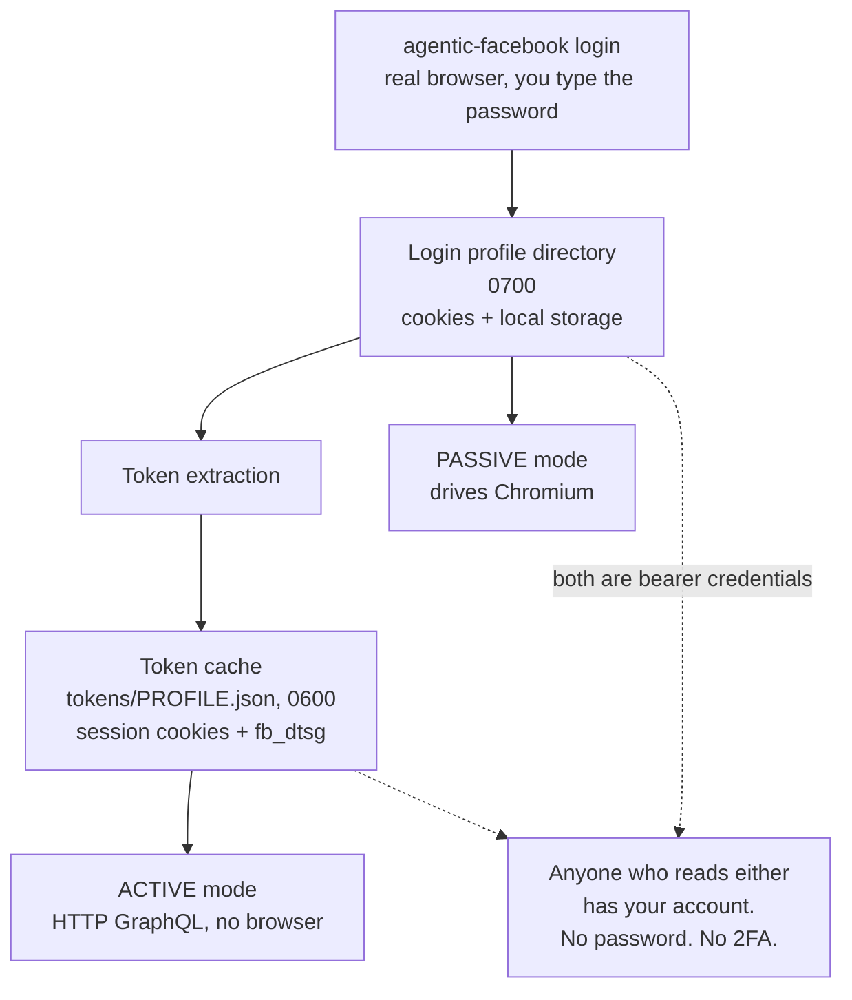

# Security and Privacy

What `agentic-facebook` stores on your disk, what it exposes about other people, and what you are responsible for once you run it.

> **[DISCLAIMER.md](../../DISCLAIMER.md) is the authoritative risk document.** Nothing on this page supersedes it. This page goes one level deeper into mechanics — what the files are, which bits are set, what gets scrubbed — for anyone who wants the threat model before pointing this tool at a real account.

None of this is legal advice. If any of it matters to your situation, talk to a lawyer.

## The two credentials on your disk

Since v0.3.0 there are **two** files-on-disk that are live Facebook session credentials. Both must be protected, and both must be dealt with if a machine is compromised.

### The login profile directory

`agentic-facebook login` opens a real Chromium window, you log in by hand, and the resulting browser profile — cookies and local storage — is persisted to a directory on disk, permissioned `0700`.

That directory **is** your authenticated session. Whoever can read it can act as you on Facebook with **no password and no 2FA prompt**, because your original login already satisfied both and what remains on disk is the session state that resulted. It holds what any logged-in Chromium session for facebook.com holds: `c_user`, `xs`, `datr`, `sb` and friends, plus whatever the web client keeps in local storage.

### The token cache

Active mode does not want to launch a browser for every run, so it caches the auth material it extracted: **`<data dir>/tokens/<profile>.json`, permissioned `0600`**, holding your session cookies plus `fb_dtsg`.

This file is **exactly as sensitive as the profile directory** — same account, same lack of any second factor, and in a smaller, more portable, more copy-pasteable package. It exists separately from the profile so that a token cache can be cleared without destroying the expensive, 2FA-satisfied browser login behind it, but "separate file" does not mean "less dangerous file."

`fb_dtsg` rotates within a live session, so cached tokens go stale (after 30 minutes they are refreshed) long before the underlying login does. Staleness is a freshness property, not a security one — the session cookies in that file stay valid for as long as the session does.

### File permissions, and what they do not protect against

Both paths are created with a restrictive `umask(0o077)` set **before** the directory is created, not with a `chmod` applied afterward. The difference matters: `mkdir` followed by a later `chmod` leaves a window — however brief — during which the directory exists at the ambient umask (often `0755`, world-readable) before permissions tighten. Setting the umask first means every directory created in that call, including the shared root, is born at `0700`. The explicit `chmod` afterward is a second layer that also repairs a root directory left loose by an older version of this tool.

What that buys you: **other unprivileged local users cannot read either credential.**

What it does not buy you: anything against root, a `sudo`-capable process, physical disk access, or a filesystem-level backup. Your regular browser encrypts its cookie store behind an OS keychain; a `0700` directory is Unix permission bits, full stop. Anyone who gets the raw bytes has everything, without touching a keychain. This is **less** protected than Chrome's cookie store, not more.

### Protecting them

- **Never sync, back up, or version either path.** No Time Machine, no iCloud Drive / Dropbox / Google Drive folder, no `git add`. Each either encrypts at rest with keys you do not control, or does not encrypt at all, or hands a live session to a third-party service.
- The repository's `.gitignore` blanket-ignores `profiles/`, `*.json`, `*.ndjson`, and `*.jsonl` precisely because captured output and credentials are a PII trap. The committed test fixtures are un-ignored **by explicit filename**, never by a wildcard — a wildcard un-ignore would silently re-include any new file dropped in that directory. Do not weaken that pattern.
- Each named profile (`--profile NAME`) is an independent live session with its own credential pair. The rules apply to every one of them individually.

### Revoking them

**Deleting the local files is not enough.** Facebook's servers do not know or care that you deleted your copy — the session stays valid on their side, and anyone who already exfiltrated the bytes still has a working credential.

To actually de-authorize, go to **facebook.com → Settings → Security and Login → Where You're Logged In**, find that session, and end it remotely. That is the only action that invalidates the credential.

If a machine is lost, stolen, or compromised:

1. Revoke via **Where You're Logged In** first. This is the step that matters.
2. Then delete both the login profile directory and `<data dir>/tokens/<profile>.json` locally. Deleting one without the other leaves a usable credential behind.
3. Then deal with any captured output files still on that disk — see [third-party data](#you-may-become-a-data-controller) below.

## `--from-chrome` is different in kind

`agentic-facebook login --from-chrome` reads Chrome's encryption key from your macOS Keychain and **decrypts the Facebook cookies out of your everyday browser's cookie database**. That is literal cookie extraction — precisely the thing the default path is designed to avoid — which is why it is opt-in and never automatic.

**Why it exists at all:** copying a logged-in Chrome profile and opening it with Playwright simply does not work. Playwright launches Chrome with `--use-mock-keychain`, so Chrome cannot reach the real "Chrome Safe Storage" Keychain entry, every cookie fails to decrypt, and the copy opens logged out. Decryption is the only path that works, so the choice was between doing it explicitly and not supporting the feature.

**The tradeoff:** your everyday browser is almost certainly logged into your **main** account. Importing it therefore contradicts the throwaway-account guidance below — you end up automating exactly the account you cannot afford to lose. It may also prompt the Keychain once, and it requires the optional `chrome` extra.

The profile-listing helper is deliberately narrow about this: it reads cookie **names and domains only, never a value**, so identifying which Chrome profile has a Facebook session costs no decryption and triggers no Keychain prompt. Decryption happens only when you actually import.

**Use `agentic-facebook login` unless you specifically need this.**

## You may become a data controller

The posts you scrape belong to other people. Collecting identifiable personal data about other people can make **you** a data controller under GDPR, CCPA, or similar law — with real obligations: a lawful basis for processing, honoring access and deletion requests, and limiting retention. "It was for personal use" is not automatically a lawful basis. The MIT license on this code says nothing about, and does not excuse, privacy-law obligations around the data you collect with it.

**v0.3.0 widened this surface considerably.** `comments` collects the name, profile URL, id, and full text of *every commenter* on a post — people who never posted anything themselves and have no relationship to you at all. `feed` and `search` collect posts from people you did not specifically target. That is materially more third-party personal data, gathered from materially more people, than a single timeline.

What ends up in an output file:

- Third-party names and profile URLs
- Full message and comment text
- Signed, expiring media URLs — **bearer-like**: whoever holds one can fetch that media as you, until it expires

### Practical minimization

- **Use `--limit`.** Fetch the sample you need, not the archive you might want.
- **Prefer narrow commands.** `fetch` on one profile collects less about fewer people than `search` or `comments` on a busy thread.
- **Skip `--replies` and deep `--max-pages`** unless the question actually requires them. Both multiply both the request count and the number of people captured.
- **Delete output when you are done with it.** Retention is the obligation most easily discharged and most easily forgotten.
- **Never commit captured output**, to a public repo or a private one.
- **Do not redistribute** beyond what you would be comfortable being personally responsible for.

## Redaction: what is scrubbed and what is not

Every **diagnostic** surface — `-v`/`--verbose`, error dumps, drift dumps, anything the CLI prints to your terminal — routes through one shared scrub path. Concentrating it in one module is the point: redacting some paths and not others is exactly how a sensitive value ends up in a bug report or a screenshot.

**What it scrubs:**

- **Session-credential fields**, in both the JSON `"key":"value"` shape and the bare `key=value` shape (querystrings, raw cookie or header lines dumped into an error): `fb_dtsg`, `lsd`, `jazoest`, `datr`, `sb`, `c_user`, `xs`, `token`, `access_token`, `cookie`, `authorization`.
- **Signed media URLs** — the query string carrying the signing material is stripped off `fbcdn.net` / `fbstatic-a.akamaihd.net` URLs. Host matching is anchored at the domain boundary, so a lookalike host like `evilfbcdn.net` cannot slip past by substring.
- **Free text** — names, message bodies, titles, descriptions are truncated to 40 characters.

**What is NOT scrubbed, deliberately:**

- **Your `--output` file.** The captured posts you asked for are written out in full, unredacted. That file *is* the tool's reason to exist; a scrubbed version would defeat the point. Treat it as sensitive from the moment it is written.
- **`--raw --no-redact`.** `--raw` alone still scrubs the raw captured GraphQL node. Adding `--no-redact` disables the scrub path entirely and prints an on-screen warning. Use it locally, for debugging a parser problem, and never in a shared terminal, a screen recording, or a bug report.

**Redaction is a leakage reducer, not a certification.** It catches the shapes it knows about. It is not a guarantee that every sensitive value in an arbitrary blob is caught. Review before you paste.

## Why output never lands in the current directory

Without `--output`, results are written under the platform data directory with a timestamped name — never `.`, and never anywhere inside a repository.

This is not a stylistic preference. The default working directory for most people running a CLI is a git repo, and captured posts contain third-party personal data. A tool that defaults to `.` will eventually put other people's names and comment text into someone's commit history, and from there into a remote. Defaulting outside any repo makes that require a deliberate `--output`.

Exact paths are in [Configuration](Configuration.md).

## The ToS and ban reality

**Automating any Meta account to collect data — including logging in with a real browser and reading what it loads — violates Facebook's Terms of Service.** Meta enforces this with temporary bans, permanent bans, checkpoint / "login approval" challenges, cease-and-desist letters, and in some cases litigation. Using this tool is entirely at your own risk.

Active mode raises this risk rather than lowering it. Reading GraphQL over plain HTTP is much faster than scrolling a browser, which means far more requests per minute are *possible* — and a burst of API requests is more conspicuous than a person scrolling.

Two floors are enforced in code and **cannot be set to zero, bypassed by a flag, or avoided by calling the Python API directly**:

- **≥ 1.0s between active requests**
- **≥ 0.5s between scrolls**

Values below the floor are silently raised, with a note on stderr. This is the one hard limit in the project, and it applies identically to both transports — otherwise "switch to active mode" would be a way around it. Deep pagination (`--max-pages`) and `comments --replies` both multiply request counts; prefer a `--limit`.

### The throwaway-account rule

**Use a dedicated or throwaway Facebook account, not your primary one.** The guardrails reduce risk; they do not remove it. Nothing in this tool makes it safe to automate an account you cannot afford to lose — and this is the specific guidance that `--from-chrome` quietly contradicts, since your everyday browser is logged into the account you care about.

If you hit a **checkpoint** (exit code 3): stop immediately and do not retry. Hammering a flagged account turns a temporary block into a permanent one. Clear the challenge by hand in a normal browser. See [FAQ and Troubleshooting](FAQ-and-Troubleshooting.md#start-here-the-exit-code-told-you-more-than-the-message-did).

## Reporting a vulnerability

**Do not open a public issue for a security vulnerability.** Use GitHub's **private vulnerability reporting** on this repository — the *Security* tab → *Report a vulnerability* — which opens a private advisory visible only to you and the maintainer. Full details are in [SECURITY.md](../../SECURITY.md).

In scope: anything that leaks a session credential or captured third-party data through a path that is supposed to be protected — a redaction bypass on a diagnostic surface, credential files created with permissions looser than `0700`/`0600`, an unvalidated identifier reaching the authenticated browser as a navigation primitive, or a dependency issue with a concrete exploit path here.

Out of scope: that this tool violates Facebook's Terms of Service, that output files are unredacted, and that `--raw --no-redact` disables scrubbing. All three are documented, deliberate design decisions — see [DISCLAIMER.md](../../DISCLAIMER.md).

When reporting, include a reproduction and the version. **Do not attach real captured output or real session tokens** — redact or synthesize them, because a vulnerability report should not itself be a data leak.

---

**Next:** [Configuration](Configuration.md) for where every path lives and how to override it, [FAQ and Troubleshooting](FAQ-and-Troubleshooting.md) for exit codes and recovery, and [DISCLAIMER.md](../../DISCLAIMER.md) as the authoritative risk document. Back to the [wiki index](README.md).
